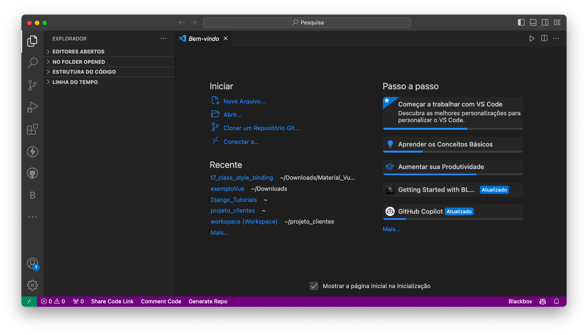
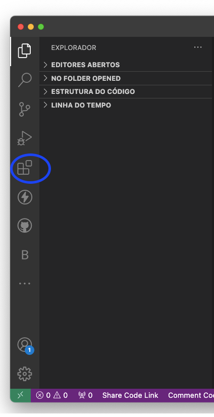
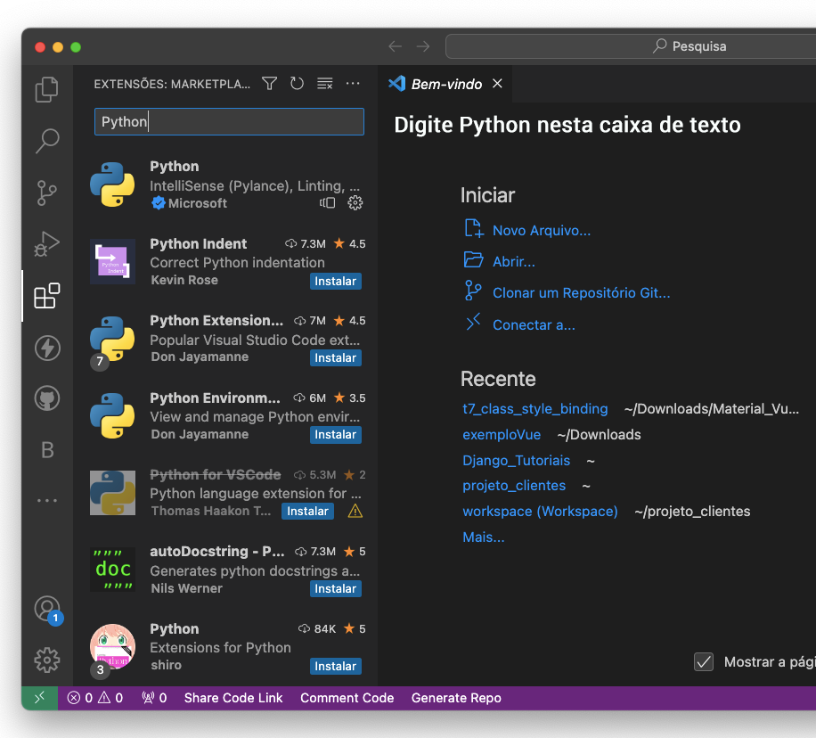
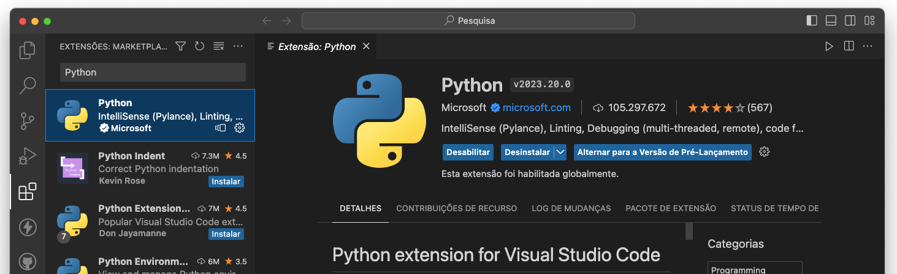

# Tutorial 01 – Instalando a Linguagem Python e o Visual Studio Code (VSCode)

## Passo #1: Instalando Python

> **Observação**: durante o processo de instalação, não se esqueça de habilitar o `PATH`.
> 
> É de vital importância que você o habilite

Para prosseguir, siga as instruções abaixo, de acordo com o Sistema Operacional da sua máquina. 
> **Atenção**: procure instalar Python a partir da versão 3.10 para frente

1. [https://python.org.br/instalacao-windows/](https://python.org.br/instalacao-windows/)
2. [https://python.org.br/instalacao-linux/](https://python.org.br/instalacao-linux/)
3. [https://python.org.br/instalacao-mac/](https://python.org.br/instalacao-mac/)

## Passo #2: Instalando o VS Code

* Faça o download do VS Code neste link:
[https://code.visualstudio.com/Download](https://code.visualstudio.com/Download)
* Escolha o Sistema Operacional de acordo com sua máquina e faça o _download_
* Clique no arquivo baixado para efetuar a instalação
* Após a instalação do aplicativo, clique duas vezes para abri-lo
* Você verá algo parecido com a figura abaixo.

## Passo #3: Instalando a extensão para trabalhar com Python

2.1) Clique no ícone da figura abaixo que fica no lado esquerdo (Barra de Atividades). Ele faz o gerenciamento das extensões.

2.2) Digite `Python` na caixa de texto à esquerda
Você irá visualizar uma lista das extensões mais populares do VS Code.

2.3) Clique na primeira opção da lista. Depois, clique no botão azul “**Instalar**”. Quando a instalação estiver completa, o botão “**Instalar**” irá mudar para “**Desinstalar**”. Irá aparecer também o botão “Desabilitar”.

Parabéns, agora você pode começar a programar em Python usando o Visual Studio Code. 